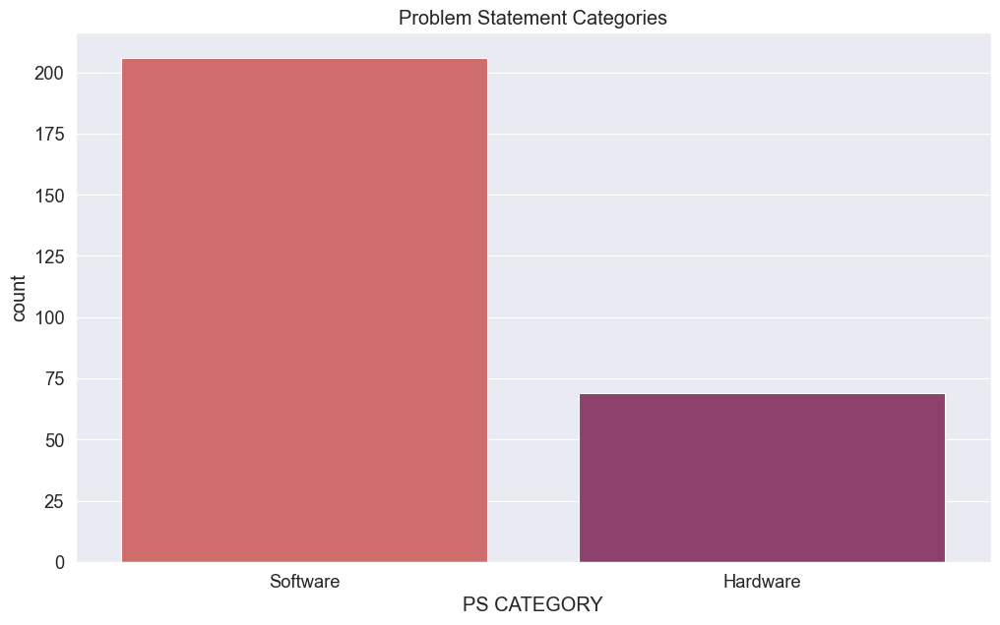
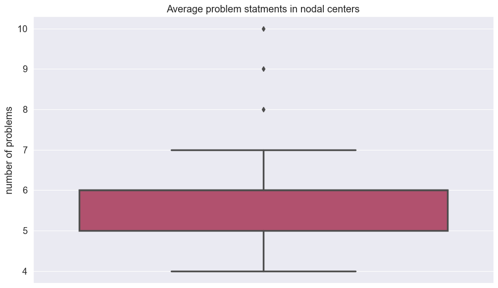
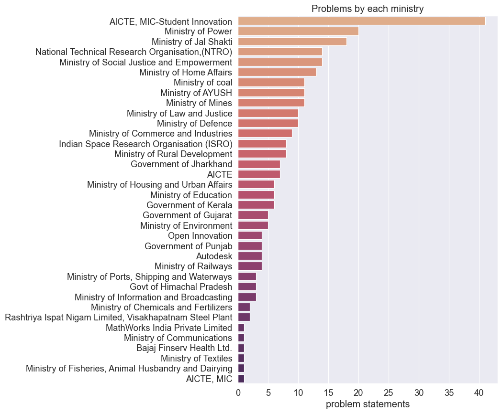
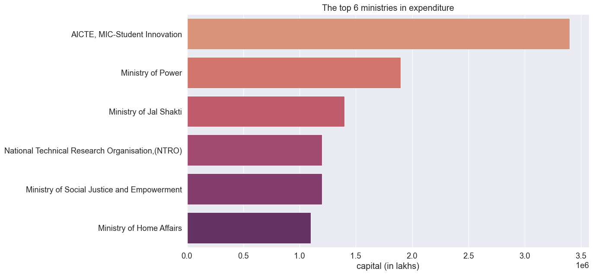
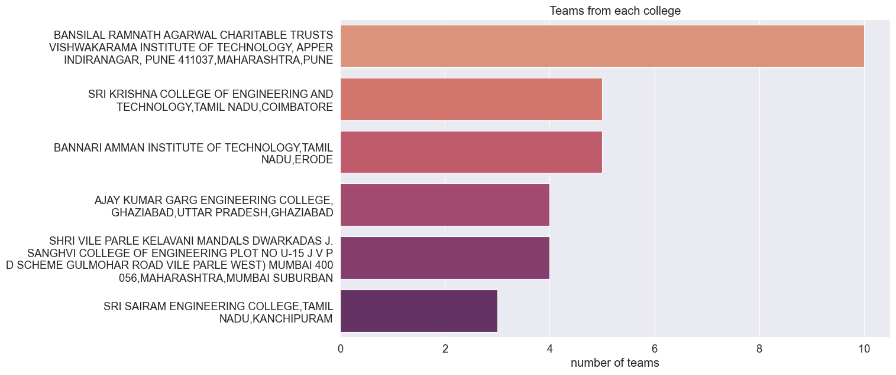

# Analysis of the Smart India Hackathon result 2023

The data used for this analysis is scrapped from the official [SIH website](https://www.sih.gov.in/sih2023-grand-finale-result) and is publicly available here [github link]('link')

```python
import pandas as pd
import seaborn as sns
import matplotlib.pyplot as plt
```

_just some default configurations to make the outputs look pretty_

```python
plt.style.use('ggplot')
sns.set_palette('cool')
sns.set(rc={"figure.figsize":(12, 7)})
sns.set_context("paper", font_scale=1.5, rc={"lines.linewidth": 2.5})
pd.set_option('display.max_columns', 200)
```

## Getting the Dataset

```python
df = pd.read_excel(r'sih-2023-result.xlsx', index_col = 0)
df
```

<div>
<table border="1" class="dataframe">
  <thead>
    <tr style="text-align: right;">
      <th></th>
      <th>ORGANISATION</th>
      <th>PSID</th>
      <th>PS CATEGORY</th>
      <th>TEAM ID</th>
      <th>IDEA ID</th>
      <th>TEAM NAME</th>
      <th>TEAM LEADER NAME</th>
      <th>COLLEGE ID</th>
      <th>COLLEGE</th>
      <th>NODAL CENTER</th>
      <th>Winning Status</th>
      <th>Prize Money</th>
    </tr>
    <tr>
      <th>S.NO.</th>
      <th></th>
      <th></th>
      <th></th>
      <th></th>
      <th></th>
      <th></th>
      <th></th>
      <th></th>
      <th></th>
      <th></th>
      <th></th>
      <th></th>
    </tr>
  </thead>
  <tbody>
    <tr>
      <th>1</th>
      <td>AICTE</td>
      <td>SIH1458</td>
      <td>Software</td>
      <td>27179</td>
      <td>50141</td>
      <td>Swasthya Sahayak</td>
      <td>PRAVEEN KUSHWAHA</td>
      <td>158737</td>
      <td>AJAY KUMAR GARG ENGINEERING COLLEGE, GHAZIABAD...</td>
      <td>O P Jindal University, Raigarh,Chhattisgarh,Ra...</td>
      <td>Winner</td>
      <td>100000</td>
    </tr>
    <tr>
      <th>2</th>
      <td>AICTE</td>
      <td>SIH1459</td>
      <td>Software</td>
      <td>37933</td>
      <td>48853</td>
      <td>Team.Phoenix</td>
      <td>HARSH DHARIWAL</td>
      <td>103534</td>
      <td>JAYPEE INSTITUTE OF INFORMATION TECHNOLOGY, NO...</td>
      <td>O P Jindal University, Raigarh,Chhattisgarh,Ra...</td>
      <td>Winner</td>
      <td>100000</td>
    </tr>
    <tr>
      <th>3</th>
      <td>AICTE</td>
      <td>SIH1460</td>
      <td>Software</td>
      <td>16793</td>
      <td>47672</td>
      <td>Bit Lords V1</td>
      <td>TANMAI KIRAN KAMAT</td>
      <td>139772</td>
      <td>SHRI VILE PARLE KELAVANI MANDALS DWARKADAS J. ...</td>
      <td>O P Jindal University, Raigarh,Chhattisgarh,Ra...</td>
      <td>Winner</td>
      <td>100000</td>
    </tr>
    <tr>
      <th>4</th>
      <td>AICTE</td>
      <td>SIH1461</td>
      <td>Software</td>
      <td>15122</td>
      <td>18545</td>
      <td>AssetSentinels</td>
      <td>PRATHAM POOJARI</td>
      <td>139723</td>
      <td>MAHAVIR EDUCATION TRUSTS SHAH AND ANCHOR KUTCH...</td>
      <td>O P Jindal University, Raigarh,Chhattisgarh,Ra...</td>
      <td>Winner</td>
      <td>100000</td>
    </tr>
    <tr>
      <th>5</th>
      <td>AICTE</td>
      <td>SIH1463</td>
      <td>Software</td>
      <td>28137</td>
      <td>33801</td>
      <td>Sane No More</td>
      <td>SNEHA JANARTHANAN</td>
      <td>150210</td>
      <td>SRI KRISHNA COLLEGE OF ENGINEERING AND TECHNOL...</td>
      <td>O P Jindal University, Raigarh,Chhattisgarh,Ra...</td>
      <td>Winner</td>
      <td>100000</td>
    </tr>
    <tr>
      <th>...</th>
      <td>...</td>
      <td>...</td>
      <td>...</td>
      <td>...</td>
      <td>...</td>
      <td>...</td>
      <td>...</td>
      <td>...</td>
      <td>...</td>
      <td>...</td>
      <td>...</td>
      <td>...</td>
    </tr>
    <tr>
      <th>271</th>
      <td>Open Innovation</td>
      <td>0</td>
      <td>Software</td>
      <td>298</td>
      <td>4826</td>
      <td>CodeElixir_T187</td>
      <td>AGNISHA BHATTA</td>
      <td>164138</td>
      <td>TECHNO INTERNATIONAL NEW TOWN</td>
      <td>Veer Surendra Sai University of Technology, Od...</td>
      <td>Second Runnerup</td>
      <td>50000</td>
    </tr>
    <tr>
      <th>272</th>
      <td>AICTE, MIC-Student Innovation</td>
      <td>SIH1484</td>
      <td>Software</td>
      <td>6451</td>
      <td>46658</td>
      <td>SeedShare</td>
      <td>APURVA NARAYAN</td>
      <td>149873</td>
      <td>SRI SIVASUBRAMANIYA NADAR COLLEGE OF ENGINEERI...</td>
      <td>Prasad V Potluri Siddhartha Institute of Techn...</td>
      <td>AWS Winner</td>
      <td>50000</td>
    </tr>
    <tr>
      <th>273</th>
      <td>AICTE, MIC-Student Innovation</td>
      <td>SIH1486</td>
      <td>Software</td>
      <td>11415</td>
      <td>15645</td>
      <td>Destination Designer</td>
      <td>GAURAV TIWARI</td>
      <td>143391</td>
      <td>NATIONAL INSTITUTE OF SCIENCE AND TECHNOLOGY N...</td>
      <td>Rungta College of Engineering and Technology, ...</td>
      <td>AWS Winner</td>
      <td>50000</td>
    </tr>
    <tr>
      <th>274</th>
      <td>AICTE, MIC-Student Innovation</td>
      <td>SIH1488</td>
      <td>Software</td>
      <td>15372</td>
      <td>21270</td>
      <td>CodeCopter</td>
      <td>ADITYA HAKANI</td>
      <td>109898</td>
      <td>3025-SHRI BHAGUBHAI MAFATLAL POLYTECHNIC, MUMB...</td>
      <td>Sreenidhi Institute of Science &amp;amp; Technolog...</td>
      <td>AWS Winner</td>
      <td>50000</td>
    </tr>
    <tr>
      <th>275</th>
      <td>AICTE, MIC-Student Innovation</td>
      <td>SIH1493</td>
      <td>Software</td>
      <td>18569</td>
      <td>11066</td>
      <td>Grand Line</td>
      <td>SHREYAS M MURAGODMATH</td>
      <td>102942</td>
      <td>KLE TECHNOLOGICAL UNIVERSITY,KARNATAKA,DHARWAD</td>
      <td>GMR Institute Of Technology,Andhra Pradesh,Rajam</td>
      <td>AWS Winner</td>
      <td>50000</td>
    </tr>
  </tbody>
</table>
<p>275 rows × 12 columns</p>
</div>

```python
df.nunique()
```

    ORGANISATION         36
    PSID                228
    PS CATEGORY           2
    TEAM ID             275
    IDEA ID             275
    TEAM NAME           275
    TEAM LEADER NAME    273
    COLLEGE ID          201
    COLLEGE             213
    NODAL CENTER         48
    Winning Status        7
    Prize Money           5
    dtype: int64

The Dataset itself is clean so we don't need to much preprocessing in it.

We will directly jump to **exploratory data analysis (EDA)**

## What is the total money that was given out to the winners?

```python
import locale
locale.setlocale(locale.LC_MONETARY, 'en_IN')

val = df['Prize Money'].sum()
print(locale.currency(val, grouping=True))

```

    ₹ 2,27,10,000.00

More than 2 crores rupees were spent just on prizes

## What is the distribution of problem statements into the two categories?

```python
sns.countplot(x = df['PS CATEGORY'], palette='flare').set_title("Problem Statement Categories");
```



The software solutions outnumber hardware solutions by more than double.

Looks like the government requires more software solutions then hardware.

## What is the average distribution of problem statements in nodal centres??

```python
sns.boxplot(list(df.groupby(by='NODAL CENTER')['PSID'].count()), palette='flare').set(xticklabels=[], title="Average problem statments in nodal centers", ylabel="number of problems");
```



On average 5-6 problem statements are assigned to each nodal center

## Which orgs has the most problem statements?

```python
fig, axes = plt.subplots(figsize = (7,10))
vals = df['ORGANISATION'].value_counts()
axes = sns.barplot(y = vals.index, x=vals.values, palette='flare').set(xlabel="problem statements", title="Problems by each ministry")
```



As expected AICTE has the most number of problem statements because of there student innovation track in which the students can submit any of there idea. They are followed by Ministry of Power and Jal Shakti.

## What are the top 6 orgs which gave away the most money??

```python
vals = df[['ORGANISATION', 'Prize Money']].groupby(by='ORGANISATION')['Prize Money'].sum().sort_values(ascending=False)[:6]
sns.barplot(y=vals.index, x=vals.values, palette='flare').set(xlabel="capital (in lakhs)", ylabel="", title="The top 6 ministries in expenditure");
```



The number of problem statements of a ministry directly correlate with the expenditure on prizes meaning more problems, more money.

_or was it more money, more problems_ 😉

## Which colleges had the most participants??

```python
import textwrap
def wrap_labels(ax, width, break_long_words=False):
    labels = []
    for label in ax.get_yticklabels():
        text = label.get_text()
        labels.append(textwrap.fill(text, width=width,
                      break_long_words=break_long_words))
    ax.set_yticklabels(labels, rotation=0)
    return ax
```

```python
vals = df['COLLEGE'].value_counts()[:6]
ax = sns.barplot(y=vals.index, x=vals.values, palette='flare')
ax = wrap_labels(ax, 50)
ax.set(title='Teams from each college', xlabel='number of teams');
```



A wopping 10 teams were sent by BRACTVIT, Pune.

## Do Nodal Centres also participate in the hackathon??

```python
if len(df.query('COLLEGE == `NODAL CENTER`')) > 0:
    print("Yeah nodal centres also participate")
else:
    print("No nodal centres don't participate")
```

    No nodal centres don't participate

## What is the ranking of the Nodal centres based on the number of problem statements they hosted?

```python
print('Problem Statements in each nodel centre')
vals = pd.DataFrame(df['NODAL CENTER'].value_counts())
vals.index.names = ['NODAL CENTRES']
vals.rename(columns = {'NODAL CENTER':'PROBLEM STATEMENTS'}, inplace = True)
vals
```

    Problem Statements in each nodel centre

<div>
<table border="1" class="dataframe">
  <thead>
    <tr style="text-align: right;">
      <th></th>
      <th>PROBLEM STATEMENTS</th>
    </tr>
    <tr>
      <th>NODAL CENTRES</th>
      <th></th>
    </tr>
  </thead>
  <tbody>
    <tr>
      <th>Lovely Professional University,Punjab,Jalandhar</th>
      <td>10</td>
    </tr>
    <tr>
      <th>Nalla Malla Reddy Engineering College,Telangana,Hyderabad</th>
      <td>9</td>
    </tr>
    <tr>
      <th>Gujarat Technological University, Ahmedabad,Gujarat,Ahmedabad</th>
      <td>8</td>
    </tr>
    <tr>
      <th>P.S.N.A. College of Engineering and Technology,Tamil Nadu,Dindigul</th>
      <td>7</td>
    </tr>
    <tr>
      <th>Sreenidhi Institute of Science &amp;amp; Technology,Telangana,Hyderabad</th>
      <td>7</td>
    </tr>
    <tr>
      <th>The National Institute of Engineering,Karnataka,Mysuru</th>
      <td>7</td>
    </tr>
    <tr>
      <th>Anand Institute of Higher Technology,Tamil Nadu,Chennai</th>
      <td>7</td>
    </tr>
    <tr>
      <th>Galgotias University ,Uttar Pradesh,Greater Noida</th>
      <td>7</td>
    </tr>
    <tr>
      <th>Chandigarh Engineering College-CGC Landran,Punjab,Mohali</th>
      <td>7</td>
    </tr>
    <tr>
      <th>Amity University Uttar Pradesh, Noida,Uttar Pradesh,Noida</th>
      <td>7</td>
    </tr>
    <tr>
      <th>Prasad V Potluri Siddhartha Institute of Technology,Andhra Pradesh,Vijayawada</th>
      <td>6</td>
    </tr>
    <tr>
      <th>Oriental Institute of Science and Technology,Madhya Pradesh,Bhopal</th>
      <td>6</td>
    </tr>
    <tr>
      <th>Sri Venkateswara College of Engineering and Technology ,Andhra Pradesh,Chittoor</th>
      <td>6</td>
    </tr>
    <tr>
      <th>Techno Main Salt Lake,West Bengal,Kolkata</th>
      <td>6</td>
    </tr>
    <tr>
      <th>Coimbatore Innovation and Business Incubator (Forge),Tamil Nadu,Coimbatore</th>
      <td>6</td>
    </tr>
    <tr>
      <th>Noida Institute of Engineering and Technology, Greater Noida,Uttar Pradesh,Greater Noida</th>
      <td>6</td>
    </tr>
    <tr>
      <th>Rungta College of Engineering and Technology, Bhilai,Chhattisgarh,Bhilai</th>
      <td>6</td>
    </tr>
    <tr>
      <th>Aditya Engineering College,Andhra Pradesh,Surampalem</th>
      <td>6</td>
    </tr>
    <tr>
      <th>IES College of Technology,Madhya Pradesh,Bhopal</th>
      <td>6</td>
    </tr>
    <tr>
      <th>New Horizon College of Engineering, Bangalore,Karnataka,Bangalore</th>
      <td>6</td>
    </tr>
    <tr>
      <th>G H Raisoni College of Engineering,Maharashtra,Nagpur</th>
      <td>6</td>
    </tr>
    <tr>
      <th>VNR Vignana Jyothi Institute of Engineering &amp;amp; Technology,Telangana,Hyderabad</th>
      <td>6</td>
    </tr>
    <tr>
      <th>Manav Rachna International Institute of Research and Studies,Haryana,Faridabad</th>
      <td>6</td>
    </tr>
    <tr>
      <th>Poornima Institute of Engineering &amp;amp; Technology,Rajasthan,Jaipur</th>
      <td>6</td>
    </tr>
    <tr>
      <th>Vidyavardhaka College of Engineering,Karnataka,Mysuru</th>
      <td>6</td>
    </tr>
    <tr>
      <th>GMR Institute Of Technology,Andhra Pradesh,Rajam</th>
      <td>6</td>
    </tr>
    <tr>
      <th>Lakshmi Narain College of Technology,Madhya Pradesh,Bhopal</th>
      <td>6</td>
    </tr>
    <tr>
      <th>The Assam Royal Global University,Assam,Guwahati</th>
      <td>5</td>
    </tr>
    <tr>
      <th>GIET University, Gunupur, Odisha,Odisha,Gunupur</th>
      <td>5</td>
    </tr>
    <tr>
      <th>St. Joseph'S College of Engineering,Tamil Nadu,Chennai</th>
      <td>5</td>
    </tr>
    <tr>
      <th>Techno India NJR Institute of Technology,Rajasthan,Udaipur</th>
      <td>5</td>
    </tr>
    <tr>
      <th>O P Jindal University, Raigarh,Chhattisgarh,Raigarh</th>
      <td>5</td>
    </tr>
    <tr>
      <th>Kolhapur Institute of Technology'S College of Engineering (Autonomous), Kolhapur,Maharashtra,Kolhapur</th>
      <td>5</td>
    </tr>
    <tr>
      <th>Vignana Bharathi Institute of Technology,Telangana,Hyderabad</th>
      <td>5</td>
    </tr>
    <tr>
      <th>QIS College of Engineering and Technology,Andhra Pradesh,Ongole</th>
      <td>5</td>
    </tr>
    <tr>
      <th>P. R. Pote Patil College of Engineering &amp;amp; Management, Amravati,Maharashtra,Amravati</th>
      <td>5</td>
    </tr>
    <tr>
      <th>Chandigarh Engineering College, Jhanjeri, Mohali,Punjab,Mohali</th>
      <td>5</td>
    </tr>
    <tr>
      <th>Manipal University Jaipur,Rajasthan,Jaipur</th>
      <td>5</td>
    </tr>
    <tr>
      <th>MIT Art, Design and Technology University, Pune,Maharashtra,Pune</th>
      <td>5</td>
    </tr>
    <tr>
      <th>Bhilai Institute of Technology, Durg,Chhattisgarh,Durg</th>
      <td>5</td>
    </tr>
    <tr>
      <th>Techno India Unversity,West Bengal,Kolkata</th>
      <td>4</td>
    </tr>
    <tr>
      <th>Prin L. N. Welingkar Institute of Management Development &amp;amp; Research (PGDM),Maharashtra,Mumbai</th>
      <td>4</td>
    </tr>
    <tr>
      <th>Shobhit Institute of Engineering and Technology ,Uttar Pradesh,Meerut</th>
      <td>4</td>
    </tr>
    <tr>
      <th>C V Raman Global University,Odisha,Bhubaneswar</th>
      <td>4</td>
    </tr>
    <tr>
      <th>Swami Keshvanand Institute of Technology, Management &amp;amp; Gramothan,Rajasthan,Jaipur</th>
      <td>4</td>
    </tr>
    <tr>
      <th>Manipal Institute of Technology, Manipal Academy of Higher Education, Manipal,Karnataka,Manipal</th>
      <td>4</td>
    </tr>
    <tr>
      <th>Chennai Institute of Technology,Tamil Nadu,Chennai</th>
      <td>4</td>
    </tr>
    <tr>
      <th>Veer Surendra Sai University of Technology, Odisha, Sambalpur</th>
      <td>4</td>
    </tr>
  </tbody>
</table>
</div>

<br>[](
https://github.com/DuanBoomer)
